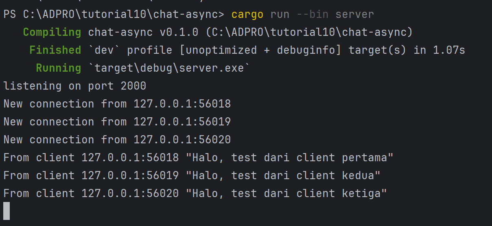
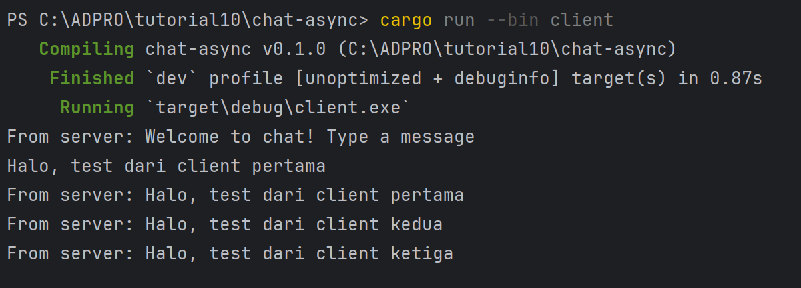
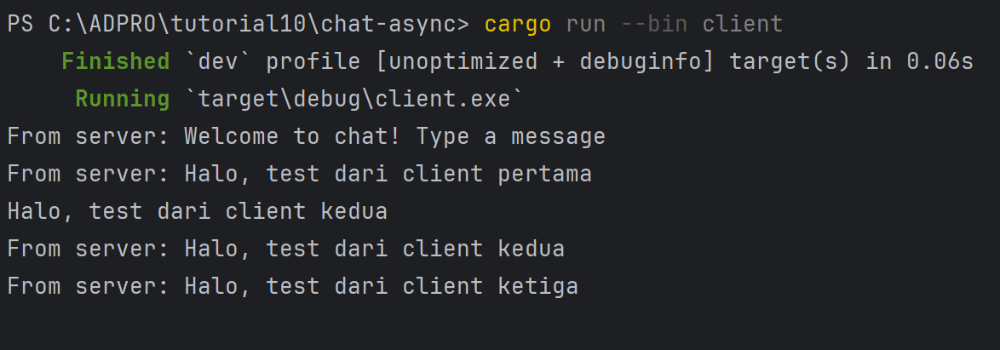
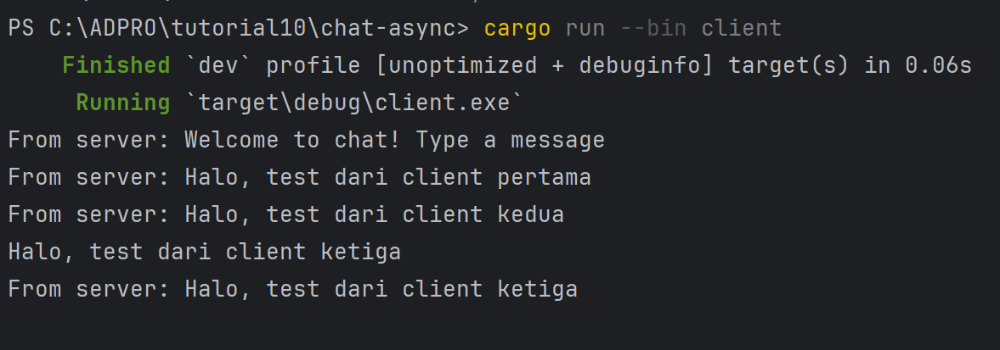

# TUTORIAL 10 (BROADCAST)

**Name:** Theodore Kevin Himawan

**NPM:** 2306210973

**Class:** ADPRO A

## Reflection 2.1

### Server

### Client 1

### Client 2

### Client 3

>How to run it?

- Run the server: <code>cargo run --bin server</code>
- Run the clients: <code>cargo run --bin client</code>

>What happens when we type some text in the clients?

When sending a text in the client, it will show up in the server (with the message and port names). Also, writing a text in any one of the client would result in the messaging being sent to all of the other active clients

## Reflection 2.2

> Take a look at the other files that need to be modified. Is it also using
the same websocket protocol? Where is it defined?

I changed both the client side and server side to listen on port 8080. The new version is still using the same WebSocket protocol for the client side. In the client side, it is defined in the ClientBuilder, while in the server side, it is defined in the TcpListener.
